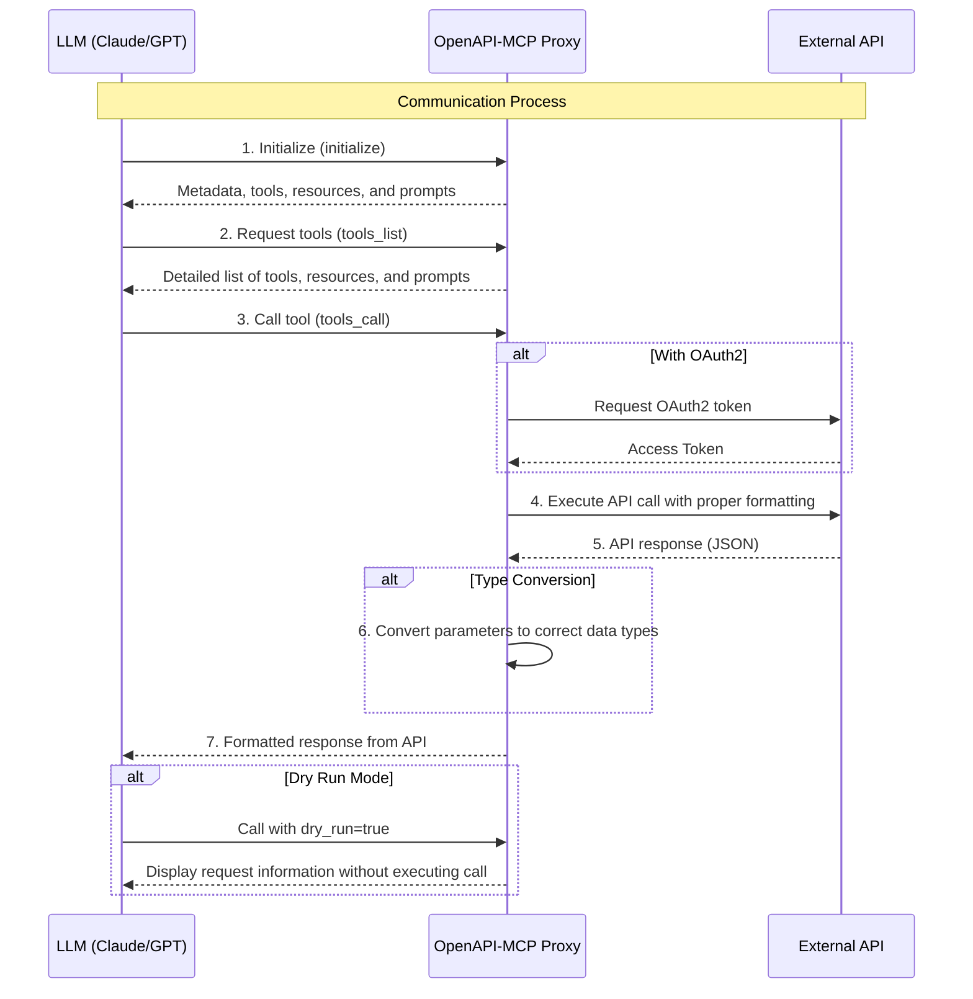

# OpenAPI to Model Context Protocol (MCP)

[](LICENSE)


**The OpenAPI-MCP proxy translates OpenAPI specs into MCP tools, enabling AI agents to access external APIs without custom wrappers!**


## Bridge the gap between AI agents and external APIs

The OpenAPI to Model Context Protocol (MCP) proxy server bridges the gap between AI agents and external APIs by **dynamically translating** OpenAPI specifications into standardized **MCP tools**, **resources**, and **prompts**. This simplifies integration by eliminating the need for custom API wrappers.

Built with a **modular architecture** following MCP best practices, the server provides robust error handling, comprehensive logging, and clean separation of concerns for maximum maintainability and extensibility.

- **Repository:** [https://github.com/gujord/OpenAPI-MCP](https://github.com/gujord/OpenAPI-MCP)

---

If you find it useful, please give it a ⭐ on GitHub!

---

## Key Features

### Core Functionality
- **FastMCP Transport:** Optimized for `stdio`, working out-of-the-box with popular LLM orchestrators.
- **OpenAPI Integration:** Parses and registers OpenAPI operations as callable tools.
- **Resource Registration:** Automatically converts OpenAPI component schemas into resource objects with defined URIs.
- **Prompt Generation:** Generates contextual prompts based on API operations to guide LLMs in using the API.
- **Dual Authentication:** Supports both OAuth2 Client Credentials flow and username/password authentication with automatic token caching.
- **JSON-RPC 2.0 Support:** Fully compliant request/response structure.

### Advanced Features
- **Modular Architecture:** Clean separation of concerns with dedicated modules for authentication, request handling, and tool generation.
- **Robust Error Handling:** Comprehensive exception hierarchy with proper JSON-RPC error codes and structured error responses.
- **Auto Metadata:** Derives tool names, summaries, and schemas from the OpenAPI specification.
- **Sanitized Tool Names:** Ensures compatibility with MCP name constraints.
- **Flexible Parameter Parsing:** Supports query strings, JSON, and comma-separated formats with intelligent type conversion.
- **Enhanced Parameter Handling:** Automatically converts parameters to correct data types with validation.
- **Extended Tool Metadata:** Includes detailed parameter information, response schemas, and API categorization.
- **CRUD Operation Detection:** Automatically identifies and generates example prompts for Create, Read, Update, Delete operations.

### Developer Experience
- **Configuration Management:** Centralized environment variable handling with validation and defaults.
- **Comprehensive Logging:** Structured logging with appropriate levels for debugging and monitoring.
- **Type Safety:** Full type hints and validation throughout the codebase.
- **Extensible Design:** Factory patterns and dependency injection for easy customization and testing.

## Quick Start

### Installation

```bash
git clone https://github.com/gujord/OpenAPI-MCP.git
cd OpenAPI-MCP
pip install -r requirements.txt
```

## LLM Orchestrator Configuration

For **Claude Desktop**, **Cursor**, and **Windsurf**, use the snippet below and adapt the paths accordingly:

#### Basic Configuration (No Authentication)
```json
{
  "mcpServers": {
    "petstore3": {
      "command": "full_path_to_openapi_mcp/venv/bin/python",
      "args": ["full_path_to_openapi_mcp/src/server.py"],
      "env": {
        "SERVER_NAME": "petstore3",
        "OPENAPI_URL": "https://petstore3.swagger.io/api/v3/openapi.json"
      },
      "transport": "stdio"
    }
  }
}
```

#### Norwegian Weather API (No Authentication)
```json
{
  "mcpServers": {
    "weather": {
      "command": "full_path_to_openapi_mcp/venv/bin/python",
      "args": ["full_path_to_openapi_mcp/src/server.py"],
      "env": {
        "SERVER_NAME": "weather",
        "OPENAPI_URL": "https://api.met.no/weatherapi/locationforecast/2.0/swagger"
      },
      "transport": "stdio"
    }
  }
}
```

#### With Username/Password Authentication
```json
{
  "mcpServers": {
    "secure_api": {
      "command": "full_path_to_openapi_mcp/venv/bin/python",
      "args": ["full_path_to_openapi_mcp/src/server.py"],
      "env": {
        "SERVER_NAME": "secure_api",
        "OPENAPI_URL": "https://api.example.com/openapi.json",
        "API_USERNAME": "your_username",
        "API_PASSWORD": "your_password"
      },
      "transport": "stdio"
    }
  }
}
```

#### With OAuth2 Authentication
```json
{
  "mcpServers": {
    "oauth_api": {
      "command": "full_path_to_openapi_mcp/venv/bin/python",
      "args": ["full_path_to_openapi_mcp/src/server.py"],
      "env": {
        "SERVER_NAME": "oauth_api",
        "OPENAPI_URL": "https://api.example.com/openapi.json",
        "OAUTH_CLIENT_ID": "your_client_id",
        "OAUTH_CLIENT_SECRET": "your_client_secret",
        "OAUTH_TOKEN_URL": "https://api.example.com/oauth/token"
      },
      "transport": "stdio"
    }
  }
}
```

Apply this configuration to the following files:

- Cursor: `~/.cursor/mcp.json`
- Windsurf: `~/.codeium/windsurf/mcp_config.json`
- Claude Desktop: `~/Library/Application Support/Claude/claude_desktop_config.json`

> Replace `full_path_to_openapi_mcp` with your actual installation path.

### Environment Configuration

#### Core Configuration
| Variable              | Description                          | Required | Default                |
|-----------------------|--------------------------------------|----------|------------------------|
| `OPENAPI_URL`         | URL to the OpenAPI specification     | Yes      | -                      |
| `SERVER_NAME`         | MCP server name                      | No       | `openapi_proxy_server` |

#### OAuth2 Authentication
| Variable              | Description                          | Required | Default                |
|-----------------------|--------------------------------------|----------|------------------------|
| `OAUTH_CLIENT_ID`     | OAuth client ID                      | No       | -                      |
| `OAUTH_CLIENT_SECRET` | OAuth client secret                  | No       | -                      |
| `OAUTH_TOKEN_URL`     | OAuth token endpoint URL             | No       | -                      |
| `OAUTH_SCOPE`         | OAuth scope                          | No       | `api`                  |

#### Username/Password Authentication
| Variable              | Description                          | Required | Default                |
|-----------------------|--------------------------------------|----------|------------------------|
| `API_USERNAME`        | API username for authentication      | No       | -                      |
| `API_PASSWORD`        | API password for authentication      | No       | -                      |
| `API_LOGIN_ENDPOINT`  | Login endpoint URL                   | No       | Auto-detected          |

## Architecture

### Modular Design

The OpenAPI-MCP server is built with a clean, modular architecture that separates concerns and promotes maintainability:

```
src/
├── server.py              # Main server class and entry point
├── config.py              # Configuration management
├── auth.py                # OAuth authentication handling
├── openapi_loader.py      # OpenAPI spec loading and parsing
├── request_handler.py     # Request preparation and validation
├── tool_factory.py        # Dynamic tool creation and metadata
├── schema_converter.py    # Schema conversion utilities
├── exceptions.py          # Custom exception hierarchy
└── __init__.py           # Package initialization
```

### Key Components

- **ServerConfig:** Centralized configuration management with validation
- **OAuthAuthenticator:** Token management with automatic caching and renewal
- **OpenAPILoader & Parser:** Robust spec loading with error handling
- **RequestHandler:** Advanced parameter parsing and request preparation
- **ToolFactory:** Dynamic tool generation with metadata building
- **SchemaConverter:** OpenAPI to MCP schema conversion
- **Custom Exceptions:** Structured error handling with JSON-RPC compliance

## How It Works

1. **Configuration Loading:** Validates environment variables and server configuration.
2. **OpenAPI Spec Loading:** Fetches and parses OpenAPI specifications with comprehensive error handling.
3. **Component Initialization:** Sets up modular components with dependency injection.
4. **Tool Registration:** Dynamically creates MCP tools from OpenAPI operations with full metadata.
5. **Resource Registration:** Converts OpenAPI schemas into MCP resources with proper URIs.
6. **Prompt Generation:** Creates contextual usage prompts and CRUD operation examples.
7. **Authentication:** Handles both OAuth2 and username/password authentication with token caching and automatic renewal.
8. **Request Processing:** Advanced parameter parsing, type conversion, and validation.
9. **Error Handling:** Comprehensive exception handling with structured error responses.



## Resources & Prompts

The server automatically generates comprehensive metadata to enhance AI integration:

### Resources
- **Schema-based Resources:** Automatically derived from OpenAPI component schemas
- **Structured URIs:** Resources are registered with consistent URIs (e.g., `/resource/{server_name}_{schema_name}`)
- **Type Conversion:** OpenAPI schemas are converted to MCP-compatible resource definitions
- **Metadata Enrichment:** Resources include server context and categorization tags

### Prompts
- **API Usage Guides:** General prompts explaining available operations and their parameters
- **CRUD Examples:** Automatically generated examples for Create, Read, Update, Delete operations
- **Contextual Guidance:** Operation-specific prompts with parameter descriptions and usage patterns
- **Server-specific Branding:** All prompts are prefixed with server name for multi-API environments

### Benefits
- **Enhanced Discoverability:** AI agents can better understand available API capabilities
- **Usage Guidance:** Prompts provide clear examples of how to use each operation
- **Type Safety:** Resource schemas ensure proper data structure understanding
- **Context Awareness:** Server-specific metadata helps with multi-API integration


## Example: Norwegian Weather API

The Norwegian Meteorological Institute provides an excellent example of a well-designed OpenAPI that works seamlessly with our server:

```bash
# Test with Norwegian Weather API
OPENAPI_URL="https://api.met.no/weatherapi/locationforecast/2.0/swagger" \
SERVER_NAME="weather" \
python src/server.py
```

This integration provides:
- **12 weather operations** including compact and complete forecasts
- **Geographic coordinate support** (latitude/longitude parameters)
- **Real-time weather data** with temperature, humidity, pressure, and more
- **85+ forecast periods** for detailed weather planning
- **No authentication required** - perfect for testing basic functionality

**Example API call for Oslo weather:**
```
Tool: weather_get__compact
Parameters: lat=59.9139, lon=10.7522
Result: Current weather and 85-period forecast for Oslo
```

## Development & Testing

### Code Quality
- **Type Safety:** Full type hints throughout the codebase
- **Error Handling:** Comprehensive exception hierarchy with proper error codes
- **Logging:** Structured logging with appropriate levels for debugging
- **Documentation:** Extensive docstrings and clear module organization

### Extensibility
- **Factory Patterns:** Easy to extend tool creation and metadata building
- **Dependency Injection:** Components can be easily mocked and tested
- **Modular Design:** Each module has a single responsibility and clear interfaces
- **Configuration Management:** Centralized config with validation and defaults

## Contributing

- Fork this repository.
- Create a new branch.
- Submit a pull request with a clear description of your changes.

## License

[MIT License](LICENSE)

If you find it useful, please give it a ⭐ on GitHub!
