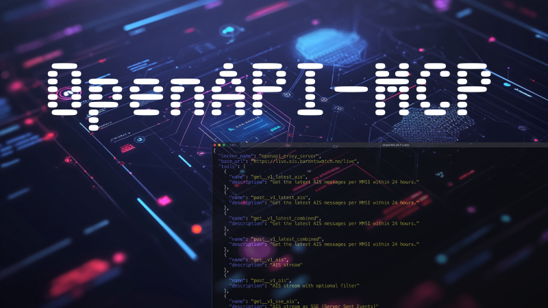

# OpenAPI-MCP (OpenAPI/Swagger to Model Context Protocol)


OpenAPI-MCP is a command-line interface (CLI) tool that leverages an OpenAPI specification to dynamically generate and call API endpoints. The tool integrates with the Model Context Protocol (MCP), allowing large language models (LLMs) to directly invoke these endpoints as callable functions.



## Features

- **Dynamic Endpoint Generation:** Loads OpenAPI specifications (JSON/YAML) to extract API endpoint details automatically.
- **Multiple Output Formats:** JSON, YAML, XML, and Markdown outputs are supported.
- **Error & Help Documentation:** Detailed messages provided for missing parameters or unknown endpoints.
- **Authentication Support:** Direct access tokens and OAuth client_credentials authentication are supported.
- **LLM Integration via MCP:** Endpoints are registered as callable tools for direct invocation by LLMs.

## Prerequisites

- Python 3.7 or newer
- Virtual environment recommended
- Dependencies listed in `requirements.txt`

## Setup Instructions

1. **Create a Virtual Environment:**

   ```bash
   python3 -m venv venv
   ```

2. **Activate the Virtual Environment:**

   - **Linux/macOS:**
     ```bash
     source venv/bin/activate
     ```

   - **Windows:**
     ```bash
     venv\Scripts\activate
     ```

3. **Install Dependencies:**

   ```bash
   pip install -r requirements.txt
   ```

## Environment Variables

Set necessary environment variables before running:

### OpenAPI Specification

- **OPENAPI_URL**: URL pointing to your OpenAPI specification (JSON/YAML).

  ```bash
  export OPENAPI_URL="https://api.met.no/weatherapi/locationforecast/2.0/swagger"
  ```

### OAuth Authentication (Optional)

If using OAuth client_credentials authentication, set:

- **OAUTH_CLIENT_ID**
- **OAUTH_CLIENT_SECRET**
- **OAUTH_SCOPE** (default: `api`)
- **OAUTH_TOKEN_URL**

Alternatively, for direct access tokens, set:

- **AUTH_TOKEN**

## Model Context Protocol (MCP) Configuration

Include the following configuration in your MCP setup to enable dynamic OpenAPI endpoint exposure:

```json
{
    "mcpServers": {
        "openapi_proxy_server": {
            "command": "bash",
            "args": [
                "-c",
                "source venv/bin/activate && python3 src/openapi-mcp.py api list-endpoints --output yaml"
            ],
            "env": {
                "OPENAPI_URL": "https://api.met.no/weatherapi/locationforecast/2.0/swagger"
            }
        }
    }
}
```

**Note: This configuration will soon change to support multiple servers.**

## Usage

### List Available Endpoints

List endpoints from the OpenAPI spec:

```bash
python3 src/openapi-mcp.py api list-endpoints --output json
```

Example (YAML):

```bash
export OPENAPI_URL="https://nvdbapiles.atlas.vegvesen.no/openapi.yaml"
python3 src/openapi-mcp.py api list-endpoints --output yaml
```

### Get Endpoint Help

Detailed help on endpoint parameters and usage:

```bash
python3 src/openapi-mcp.py api call-endpoint --name <endpoint_name> help
```

Example:

```bash
python3 src/openapi-mcp.py api call-endpoint --name get__compact help
```

### Call an Endpoint

Invoke an endpoint with parameters:

```bash
python3 src/openapi-mcp.py api call-endpoint --name get__compact --param lat=60 --param lon=10
```

Dry-run mode for testing parameters without sending a request:

```bash
python3 src/openapi-mcp.py api call-endpoint --name get__compact --param lat=60 --param lon=10 --dry-run
```

## Integration with LLMs via MCP

OpenAPI-MCP integrates with MCP, allowing LLMs to directly invoke API endpoints:

- **Dynamic Registration:** Loads and registers OpenAPI endpoints.
- **LLM Invocation:** LLMs call endpoints directly using registered operation IDs, ensuring parameter validation and proper response formatting.

This integration extends LLM capabilities by facilitating interaction with external APIs.

## Examples

### Example 1: List Endpoints (YAML)

```bash
export OPENAPI_URL="https://nvdbapiles.atlas.vegvesen.no/openapi.yaml"
python3 src/openapi-mcp.py api list-endpoints --output yaml
```

### Example 2: Endpoint Help

```bash
export OPENAPI_URL="https://api.met.no/weatherapi/locationforecast/2.0/swagger"
python3 src/openapi-mcp.py api call-endpoint --name get__compact help
```

### Example 3: Endpoint Call with Parameters

```bash
export OPENAPI_URL="https://api.met.no/weatherapi/locationforecast/2.0/swagger"
python3 src/openapi-mcp.py api call-endpoint --name get__compact --param lat=60 --param lon=10
```

## Troubleshooting

- **OPENAPI_URL:** Verify accessibility and correct OpenAPI specification format.
- **OAuth Errors:** Ensure OAuth environment variables are set properly.
- **Parameter Issues:** Use `--dry-run` to validate parameters.

## License & Credits

Refer to [LICENSE](LICENSE) for license details (MIT). For API-specific client registration, refer to the respective API provider's documentation.
