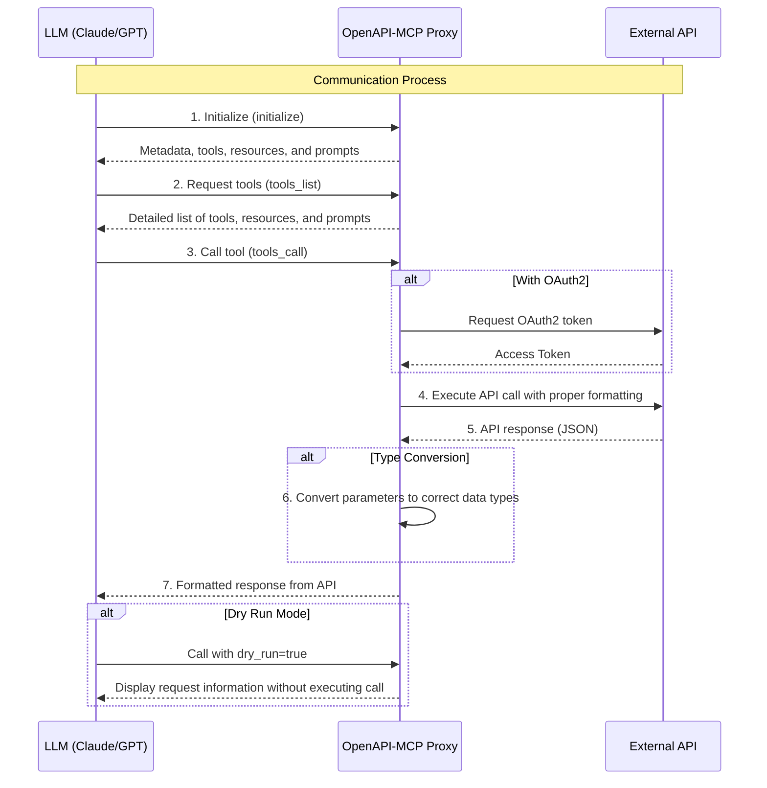

# OpenAPI to Model Context Protocol (MCP)

[](LICENSE)


The OpenAPI to Model Context Protocol (MCP) proxy server bridges the gap between AI agents and external APIs by dynamically translating OpenAPI specifications into standardized MCP tools, resources, and prompts. This simplifies integration by eliminating the need for custom API wrappers.

- **Repository:** [https://github.com/gujord/OpenAPI-MCP](https://github.com/gujord/OpenAPI-MCP)

---

## Why MCP?

The Model Context Protocol (MCP), developed by Anthropic, standardizes communication between Large Language Models (LLMs) and external tools. By acting as a universal adapter, MCP enables AI agents to interface with external APIs seamlessly.

---

## Key Features

- **OpenAPI Integration:** Parses and registers OpenAPI operations as callable tools.
- **Resource Registration:** Automatically converts OpenAPI component schemas into resource objects with defined URIs.
- **Prompt Generation:** Generates contextual prompts based on API operations to guide LLMs in using the API.
- **OAuth2 Support:** Handles machine authentication via Client Credentials flow.
- **Dry Run Mode:** Simulates API calls without execution for inspection.
- **JSON-RPC 2.0 Support:** Fully compliant request/response structure.
- **Auto Metadata:** Derives tool names, summaries, and schemas from the OpenAPI specification.
- **Sanitized Tool Names:** Ensures compatibility with MCP name constraints.
- **Flexible Parameter Parsing:** Supports query strings (with a leading "?") and multiple JSON variations (including keys with dots and numeric values).
- **Enhanced Parameter Handling:** Automatically converts parameters to the correct data types.
- **Extended Tool Metadata:** Includes detailed parameter information and response schemas.
- **FastMCP Transport:** Optimized for `stdio`, working out-of-the-box with popular LLM orchestrators.

---

## Quick Start

### Installation

```bash
git clone https://github.com/gujord/OpenAPI-MCP.git
cd OpenAPI-MCP
pip install -r requirements.txt
```

### Environment Configuration

| Variable              | Description                          | Required | Default                |
|-----------------------|--------------------------------------|----------|------------------------|
| `OPENAPI_URL`         | URL to the OpenAPI specification     | Yes      | -                      |
| `SERVER_NAME`         | MCP server name                      | No       | `openapi_proxy_server` |
| `OAUTH_CLIENT_ID`     | OAuth client ID                      | No       | -                      |
| `OAUTH_CLIENT_SECRET` | OAuth client secret                  | No       | -                      |
| `OAUTH_TOKEN_URL`     | OAuth token endpoint URL             | No       | -                      |
| `OAUTH_SCOPE`         | OAuth scope                          | No       | `api`                  |

---

## How It Works

1. **Parses OpenAPI Spec:** Loads the OpenAPI specification using `httpx` and `PyYAML` if needed.
2. **Registers Operations:** Extracts API operations and generates MCP-compatible tools with proper input and response schemas.
3. **Resource Registration:** Automatically converts OpenAPI component schemas into resource objects with assigned URIs (e.g., `/resource/{name}`).
4. **Prompt Generation:** Creates contextual prompts based on API operations to assist LLMs in understanding API usage.
5. **Authentication:** Supports OAuth2 authentication via the Client Credentials flow.
6. **Parameter Handling:** Converts parameters to required data types and supports flexible query string and JSON formats.
7. **Dry Run Mode:** Allows simulation of API requests without executing the actual call.
8. **JSON-RPC 2.0 Compliance:** Ensures standard communication protocols for tool interactions.



---

## Built-in Tools

The following tools are always available:

- `initialize` – Returns server metadata, resources, prompts, and protocol version.
- `tools_list` – Lists all registered tools, resources, and prompts with extended metadata.
- `tools_call` – Calls any tool by name with provided arguments.

---

## Advanced Usage

### Query String & JSON Parameter Passing

The server supports multiple variations for passing parameters via the `kwargs` field. For example, using the Swagger Petstore (petstore3) API:

- **Query String:**  
  ```json
  {
    "kwargs": "?name=doggie&status=available"
  }
  ```
- **JSON Object:**  
  ```json
  {
    "kwargs": "{\"name\": \"doggie\"}"
  }
  ```
- **JSON with Numeric Values:**  
  ```json
  {
    "kwargs": "{\"petId\": 10, \"status\": \"sold\"}"
  }
  ```
- **JSON with Dot Notation Keys:**  
  ```json
  {
    "kwargs": "{\"name.contains\": \"dog\"}"
  }
  ```
- **Multiple Parameters:**  
  ```json
  {
    "kwargs": "{\"petId\": 10, \"status\": \"sold\", \"limit\": 20}"
  }
  ```

The server automatically parses these variations and converts values based on the OpenAPI schema definitions.

---

## LLM Orchestrator Configuration

For **Claude Desktop**, **Cursor**, and **Windsurf**, use the snippet below and adapt the paths accordingly:

```json
{
  "mcpServers": {
    "petstore3": {
      "command": "full_path_to_openapi_mcp/venv/bin/python",
      "args": ["full_path_to_openapi_mcp/src/server.py"],
      "env": {
        "SERVER_NAME": "petstore3",
        "OPENAPI_URL": "https://petstore3.swagger.io/api/v3/openapi.json"
      },
      "transport": "stdio"
    }
  }
}
```

Apply this configuration to the following files:

- Cursor: `~/.cursor/mcp.json`
- Windsurf: `~/.codeium/windsurf/mcp_config.json`
- Claude Desktop: `~/Library/Application Support/Claude/claude_desktop_config.json`

> Replace `full_path_to_openapi_mcp` with your actual installation path.

---

## Resources & Prompts

In addition to tools, the proxy server now automatically registers:
- **Resources:** Derived from OpenAPI component schemas, resource objects are registered with defined URIs (e.g., `/resource/{name}`) for structured data handling.
- **Prompts:** Contextual prompts are generated based on API operations to provide usage guidance to LLMs, enhancing their understanding of available endpoints.

This extended metadata improves integration by providing comprehensive API context.

---

## Contributing

- Fork this repository.
- Create a new branch.
- Submit a pull request with a clear description of your changes.

---

## License

[MIT License](LICENSE)

---

If you find it useful, please give it a ⭐ on GitHub!
