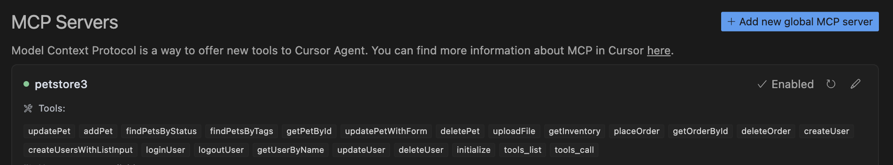

# OpenAPI to Model Context Protocol (MCP)

[](LICENSE)


The OpenAPI to Model Context Protocol (MCP) proxy server bridges the gap between AI agents and external APIs by dynamically translating OpenAPI specifications into standardized MCP tools. This simplifies integration, eliminating the need for custom API wrappers.

- **Repository:** [https://github.com/gujord/OpenAPI-MCP](https://github.com/gujord/OpenAPI-MCP)

---

## Why MCP?

The Model Context Protocol (MCP), developed by Anthropic, standardizes communication between Large Language Models (LLMs) and external tools. By acting as a universal adapter, MCP enables AI agents to interface with external APIs seamlessly.

---

## Key Features

- **OpenAPI Integration:** Parses and registers OpenAPI operations as callable tools.
- **OAuth2 Support:** Handles machine authentication via Client Credentials flow.
- **Dry Run Mode:** Simulates API calls without execution for inspection.
- **JSON-RPC 2.0 Support:** Fully compliant request/response structure.
- **Auto Metadata:** Derives tool names, summaries, and schemas from OpenAPI.
- **Sanitized Tool Names:** Ensures compatibility with MCP name constraints.
- **FastMCP Transport:** Optimized for `stdio`, works out-of-the-box with agents.

---

## Quick Start

### Installation
```bash
git clone https://github.com/gujord/OpenAPI-MCP.git
cd OpenAPI-MCP
pip install -r requirements.txt
```

### Environment Configuration

| Variable              | Description                          | Required | Default                |
|-----------------------|--------------------------------------|----------|------------------------|
| `OPENAPI_URL`         | URL to the OpenAPI specification     | Yes      | -                      |
| `SERVER_NAME`         | MCP server name                      | No       | `openapi_proxy_server` |
| `OAUTH_CLIENT_ID`     | OAuth client ID                      | No       | -                      |
| `OAUTH_CLIENT_SECRET` | OAuth client secret                  | No       | -                      |
| `OAUTH_TOKEN_URL`     | OAuth token endpoint URL             | No       | -                      |
| `OAUTH_SCOPE`         | OAuth scope                          | No       | `api`                  |

### Running the Server
```bash
# Minimal
OPENAPI_URL=https://api.example.com/openapi.json python src/server.py
```

---

## How It Works

1. **Parses OpenAPI spec** using `httpx` and `PyYAML` if needed.
2. **Extracts operations** and generates MCP-compatible tools with proper names.
3. **Authenticates** using OAuth2 (if credentials are present).
4. **Builds input schemas** based on OpenAPI parameter definitions.
5. **Handles calls** via JSON-RPC 2.0 protocol with automatic error responses.
6. **Supports dry_run** to inspect outgoing requests without invoking them.

---

## Built-in Tools

These tools are always available:

- `initialize` – Returns server metadata and protocol version.
- `tools_list` – Lists all registered tools (from OpenAPI and built-in).
- `tools_call` – Calls any tool by name with arguments.

---

## LLM Orchestrator Configuration

### Cursor (`~/.cursor/mcp.json`)
```json
{
  "mcpServers": {
    "petstore3": {
      "command": "full_path_to_openapi_mcp/venv/bin/python",
      "args": ["full_path_to_openapi_mcp/src/server.py"],
      "env": {
        "SERVER_NAME": "petstore3",
        "OPENAPI_URL": "https://petstore3.swagger.io/api/v3/openapi.json"
      },
      "transport": "stdio"
    }
  }
}
```


### Windsurf (`~/.codeium/windsurf/mcp_config.json`)
```json
{
  "mcpServers": {
    "petstore3": {
      "command": "full_path_to_openapi_mcp/venv/bin/python",
      "args": ["full_path_to_openapi_mcp/src/server.py"],
      "env": {
        "SERVER_NAME": "petstore3",
        "OPENAPI_URL": "https://petstore3.swagger.io/api/v3/openapi.json"
      },
      "transport": "stdio"
    }
  }
}
```


---

## Contributing

- Fork this repo
- Create a new branch
- Submit a pull request with a clear description

---

## License

[MIT License](LICENSE)

---

This project embraces rapid agent tool integration using LLMs like Claude 3, OpenAI GPT-4, and Gemini.  
If you find it useful, give it a ⭐ on GitHub!
